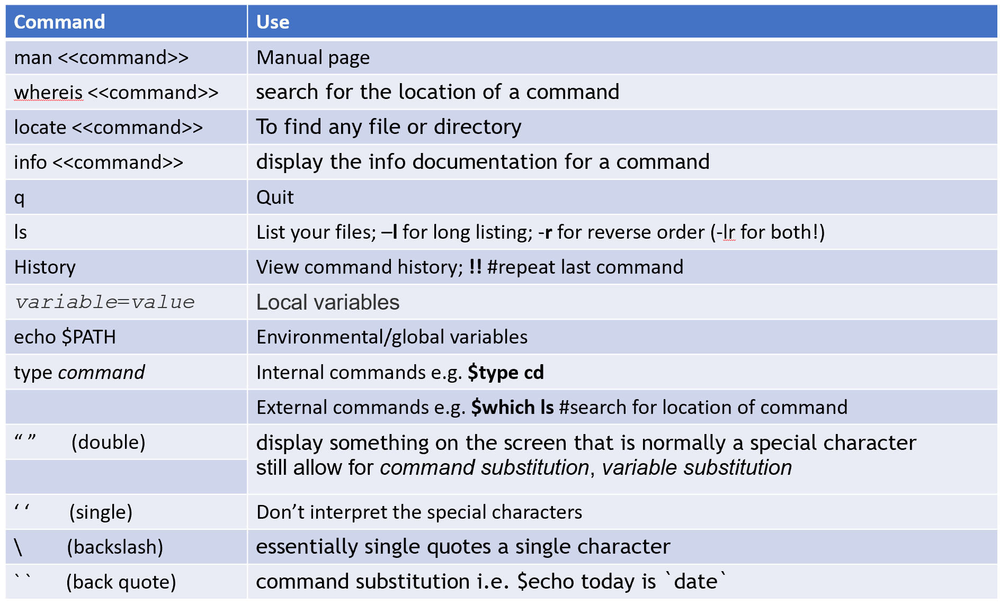
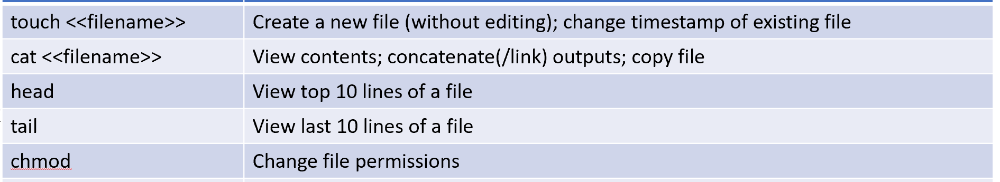

# Lab XX – <Lab Title>

## Objectives
- 
- 

## Environment
- OS: Linux
- VM: ubuntu-24.04.3-live-server-arm64 

## Procedure
Commands executed during this lab:
### setting up my VM
#### Ubuntu Server
systemctl status ssh    (show if the ssh is active or inactive in VM)
sudo systemctl start ssh    (start the ssh to allow me to connect from my mac terminal)
ip a                    (show network device/interface info - I want the inet ip address)
#### Macbook M1
ssh username@ipaddressforinet   (log into vm from mac using secure shell)

### Lab work
mkdir -p Dec/Finals     (make a nested pair of directories adding Dec as the parent if it doesnt exist)
mkdir home/adam/CertStuff/tmp/Dec/Part1     (make a directory Part1 in my Dec directory from the root)
nano home/adam/CertStuff/tmp/Dec/DecExamResuts.txt      (create a file in nano from the root)
cat home/adam/CertStuff/tmp/Dec/DecExamResuts.txt       (read the contents of the file from the root)
mv Sep September        (rename Sep directory to September)
mv September Sep        (rename September directory to Sep)
rmdir Sep               (delete Sep directory, only works if it's empty)
cd ~                    (change directory to the  user directory in home directory)
cd ..                   (go up one level in the file system)
ls
cd ~/CertStuff/tmp      (navigate to the directory I created for this lab using home/user as a starting point)
history                 (list all the commands i used in the terminal session)
!77                     (run the 77th terminal command - it was a pwd)
cd -                    (navigates back to the last folder you were in before the current one - handy to undo cd)
mkdir -p Assessment1Files/{Menu,AddRecord,RemoveRecord,SearchRecords}       (Create the directory structure using the -p flag to create the parent directory and brace expansion to create the four child directories inside.)
ls ../../ > output.txt      (redirect the output of the ls command into a file called output.txt)
cat test_?.txt          (output the contents of any file named test_(something).txt)
cat test_*              (output the contents of any file that starts with test_ and ends with anything at all)
cat t*                  (output the contents of any file that begins with t)
cat test_[1-3].txt      (output the contents of the files test_1.txt, test_2.txt and test_3.txt)
cat test_1.txt >> combined.txt      (append the contents of test_1.txt to combined.txt without overwriting)
tac tempCopy            (output the file printing lines from bottom to top - opposite of cat command)
head .bashrc            (print the first 10 lines of the .bashrc file)
head -n 5 .bashrc       (print the first 5 lines of the .bashrc file, -n # specifies how many lines to print)
head -v .bashrc         (print the filename then the first 10 lines of .bashrc)
head -vn 5 .bashrc      (print the filename then first 5 lines of .bashrc, flag taking argument goes last)
tail .bashrc | wc -l    (print the number of lines in the output of .bashrc)
tail .bashrc            (print the last 10 lines of .bashrc)
tail -vn 5 .bashrc      (print the last 5 lines of .bashrc with the file name at the top)
echo today is $(date)   (use the date command with echo by surrounding it with $() )
echo "single quote ' double quote \""       (print single and double quote character within double quotes)
ls -lh			(write human readable sizes in long listing of directory)
cal 12 24		(show the calendar for dec 2024!)
!!			(run the last command again)
!-5			(run the command that is 5th from the bottom (inclusive))
!echo			(run the echo command again with whatever the last argument was)
env			(print the environment variables)
export somevar		(make somevar an environement variable)
unset somevar		(remove somevar from the environment variables)
echo $PATH		(print out the path variable)
type cd 		(prints where the command comes from)
which ls		(finds the location of the command by searching the PATH variable)
type -a ls		(finds all times the command is named/located somewhere)
whoami          (prints the current user)
uname           (prints the name of the kernel you are using)
uname -n        (prints the name the machine you are using has been given e.g. linux-practice)
history 10      (print the last ten commands from the terminal history)
ll              (shorthand for ls -alF, long list all files & hidden and append / (dir) * (exe) @(symlink))
l               (shorthand for ls -CF, list contents appended / * @ (see above) and list by columns

in man pages:
H               (shows help for navigating around the pages)
/(search term)  (shows the first occurance of search term)
n               (moves to next occurance of search term)
shift+n         (moves back to previous occurance of search term)
man -f passwd   (show all occurances of passwd entries in the man pages)
whatis passwd   (same as above; show all occurances of passwd in the man pages)
man 5 passwd    (show the password occurence in section 5 of the man pages)
man -k copy     (prints all the commands that have copy in the name or description)
apropos copy    (same as above; prints all the commands that have copy in their name or description)

sudo apt install locate	(install the optional locate command to find files)
sudo updatedb	(update the locate db with the files on the system at this moment, otherwise its done nightly)
locate gshadow	(search the files on the system for any with gshadow in their text or name)
locate -c gshadow 	(count how many files have gshadow in their name or contents)
locate -b gshadow	(print only the files that have gshadow in their NAME)

info commands:
u 				(go up a level, back to where you clicked hyperlink)
shift+h			(display info navigation help)
m 				(pick a menu item by entering its name)
5				(pick the 5th item in this nodes menu)
tab				(skip to the next hyperlink)
enter			(choose highlighted hyperlink)
info -k ssh		(search info for all mentions of ssh)
	this returned - "(gnupg)Agent Options" -- enable-ssh-support
info "(gnupg)Agent Options"	    (navigate to the enable-ssh-support node of the gnupg manual where 
								enable-ssh-support is stored)
ls --help 			(using --help on any command gives synopsis without leaving the command line)

cd /usr/share/doc		(navigate to folder where many README.md files of various programs and system details
						can be seen)

## Captured Output
- outputs/labXX/<file1>.txt
- outputs/labXX/<file2>.txt

## Observations
- 

## Issues / Errors
- Variables such as file names will be split when you use them if not double quoted. e.g. name="Ada 
  Lovelace" -> rm $name becomes rm ada lovelace which tries to remove two files 'ada' and 'lovelace'

## Notes
- Always double-quote variable expansions and command substitutions
unless you have a specific, understood reason not to.

## Conclusion
-
